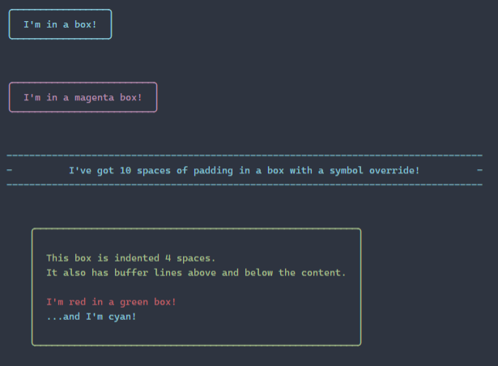

```
logBox()('I\'m in a box!');

logBox({ color: 'magenta' })('I\'m in a magenta box!');

logBox({ padding: 10, symbol: '-' })('I\'ve got 10 spaces of padding in a box with a symbol override!');

// More complex
logBox({ color: 'green', indent: 4, bufferLines: true })([
  'This box is indented 4 spaces.',
  'It also has buffer lines above and below the content.',
  '',
  { color: 'red', message: 'I\'m red in a green box!' },
  { color: 'cyan', message: '...and I\'m cyan! '},
]);
```

