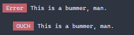

<h2>logError</h2>
<p>Log out an error message</p>
<p>Since v0.0.1</p>
<table>
      <thead>
      <tr>
        <th>Param</th>
        <th>Type</th></tr>
      </thead>
      <tbody><tr><td><p><b>config <span>(optional)</span></b></p>The configuration</td><td>StatusConfig</td></tr></tbody>
    </table><p><b>Returns:</b> {(...args: unknown[]) =&gt; void}</p><h4>Supporting Types</h4>

```
export type StatusConfig = {
  indent?: number,
  tagMessage?: string,
};
```
<h4>Import</h4>

```
import { logError } from 'console-log-it';
```

  <h4>Examples</h4>


```    
logError()('This is a bummer, man.');

const error = logError({ indent: 2, tagMessage: 'OUCH' });
error('This is a bummer, man.');
```





    