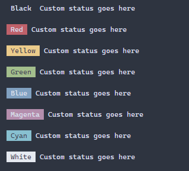

<h2>logStatus</h2>
<p>Log out a custom status message</p>
<p>Since v0.0.1</p>
<table>
      <thead>
      <tr>
        <th>Param</th>
        <th>Type</th></tr>
      </thead>
      <tbody><tr><td><p><b>config <span>(optional)</span></b></p>The configuration</td><td>CustomStatusConfig</td></tr></tbody>
    </table><p><b>Returns:</b> {(...args: unknown[]) =&gt; void}</p><h4>Supporting Types</h4>

```
export type CustomStatusConfig = {
  indent?: number,
  tagColor: Color,
  tagMessage: string,
};

export type Color = 'black' | 'red' | 'green' | 'yellow' | 'blue' | 'magenta' | 'cyan' | 'white';
```
<h4>Import</h4>

```
import { logStatus } from 'console-log-it';
```

  <h4>Examples</h4>


```    
const deprecated = logStatus({
  tagColor: 'magenta',
  tagMessage: 'Deprecated',
});

deprecated('This is a custom status tag to tell you something is deprecated');
```


<h4>Available Colors</h4>




    