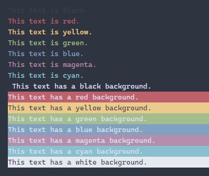

<h2>logStyle</h2>
<p>Log out a styled message</p>
<p>Since v0.0.1</p>
<table>
      <thead>
      <tr>
        <th>Param</th>
        <th>Type</th></tr>
      </thead>
      <tbody><tr><td><p><b>color</b></p>The color, background color, or style for the logged message</td><td>color: Color | BackgroundColor | Style</td></tr></tbody>
    </table><p><b>Returns:</b> {(...args: unknown[]) =&gt; void}</p><h4>Supporting Types</h4>

```
export type Color = 'black' | 'red' | 'green' | 'yellow' | 'blue' | 'magenta' | 'cyan' | 'white';
export type BackgroundColor = 'bgBlack' | 'bgRed' | 'bgGreen' | 'bgYellow' | 'bgBlue' | 'bgMagenta' | 'bgCyan' | 'bgWhite';
export type Style = 'blink' | 'bright' | 'dim' | 'hidden' | 'reverse' | 'reset' | 'underscore';
```
<h4>Import</h4>

```
import { logStyle } from 'console-log-it';
```

  <h4>Examples</h4>


```    
logStyle('green')('This message is green');

const white = logStyle('bgWhite');
white('This background is white');
white('This background is also white');
```


<h4>Available Colors</h4>




    